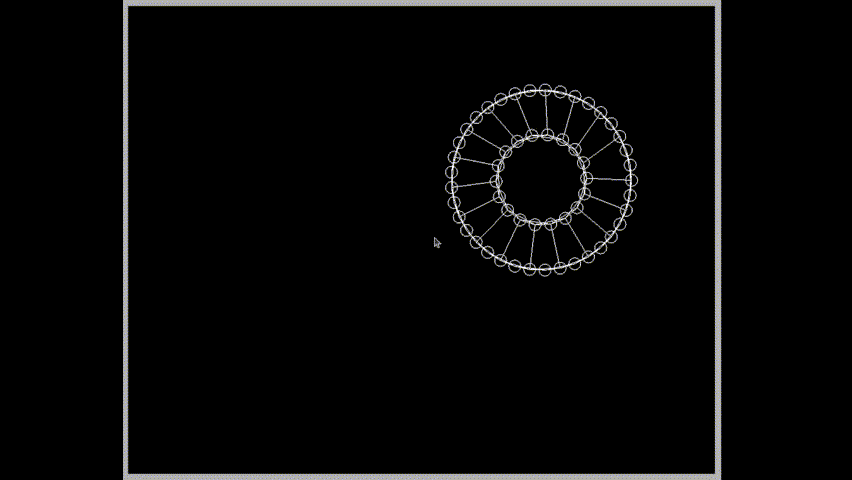

# game_engine_opengl

Small collsion engine with rigidbody and softbody collisions. 

Collision detection and resolution are implemented.

C++, OpenGL, Linux. There is build.sh script to compile project with gcc.

Balls with momentum conservation

Simple pong game in engine

Soft ball bounce

Soft cell dragging

